# 🧘‍♀️ MindfulMoments - Your Personal Mindfulness Companion

<div align="center">
  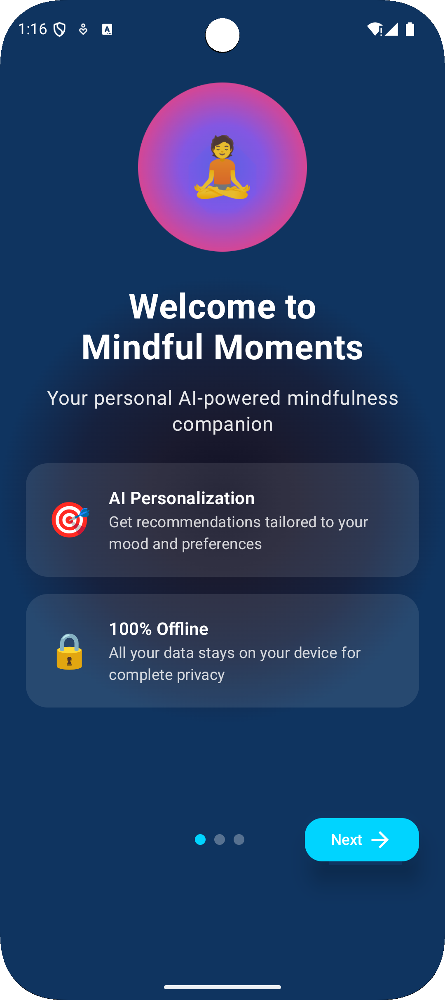
  
  [](https://developer.android.com)
  [](https://kotlinlang.org)
  [](https://developer.android.com/jetpack/compose)
</div>

## 🌟 Overview

**MindfulMoments** is a beautifully designed Android app that helps you cultivate mindfulness, track your mood, practice meditation, and build healthy habits. Built with modern Android technologies and featuring a stunning glassmorphic UI, it provides a comprehensive wellness experience right at your fingertips.

## ✨ Key Features

### 🎯 **Core Functionality**
- **Mood Tracking** - Log your daily emotions with beautiful visualizations
- **Meditation Library** - 24+ authentic guided meditation sessions
- **Breathing Exercises** - Interactive breathing patterns for stress relief
- **Progress Analytics** - Track your wellness journey with real-time insights
- **Personalized Insights** - AI-powered recommendations based on your data

### 🎨 **Modern UI/UX**
- **Glassmorphic Design** - Beautiful translucent cards with blur effects
- **Advanced Animations** - Smooth transitions and particle effects
- **Dark Theme** - Easy on the eyes with customizable colors
- **Responsive Layout** - Optimized for all screen sizes
- **Intuitive Navigation** - Clean, user-friendly interface

### 📊 **Data & Analytics**
- **Real-time Progress** - Live updates of your wellness metrics
- **Historical Tracking** - View your journey over time
- **Smart Recommendations** - Personalized suggestions based on patterns
- **Local Database** - Secure, offline-first data storage

## 📱 Screenshots

<div align="center">
  <h3>🏠 Main Dashboard</h3>
  
  
  <h3>😊 Mood Tracking</h3>
  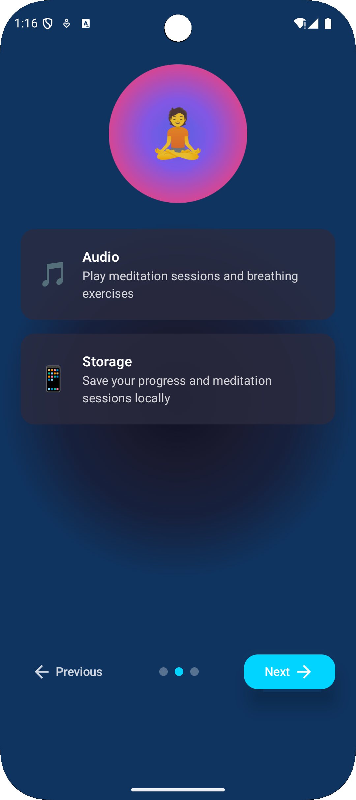
  
  <h3>🧘‍♀️ Meditation Library</h3>
  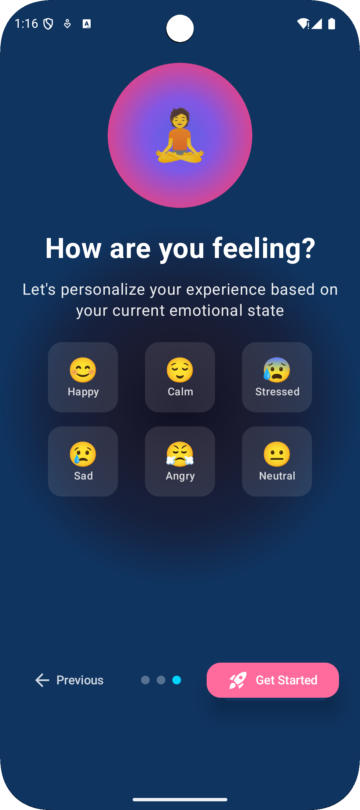
  
  <h3>💨 Breathing Exercises</h3>
  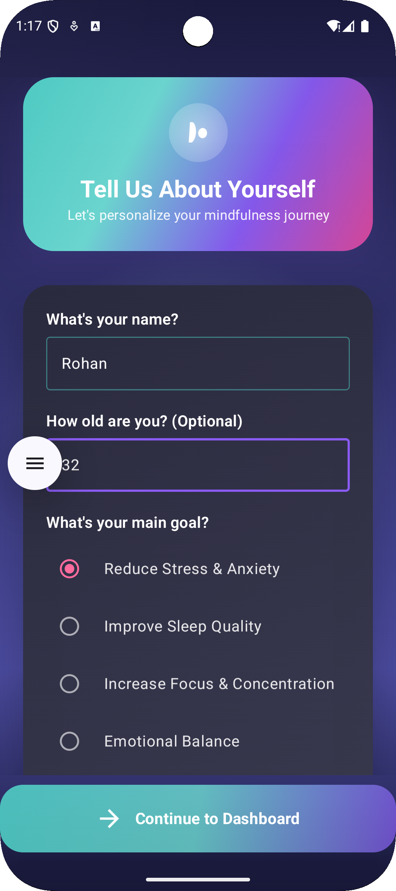
  
  <h3>📊 Insights & Analytics</h3>
  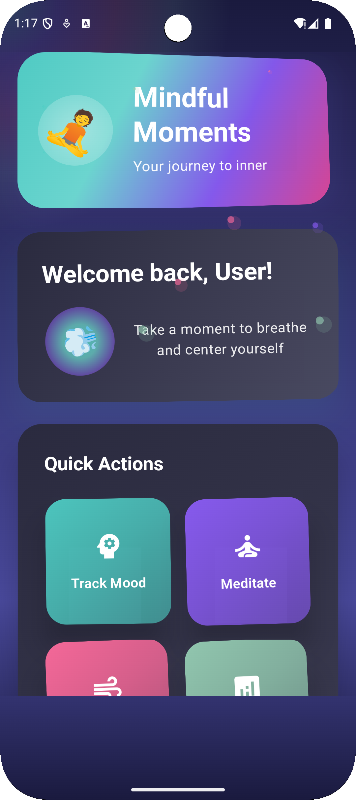
  
  <h3>👤 User Profile</h3>
  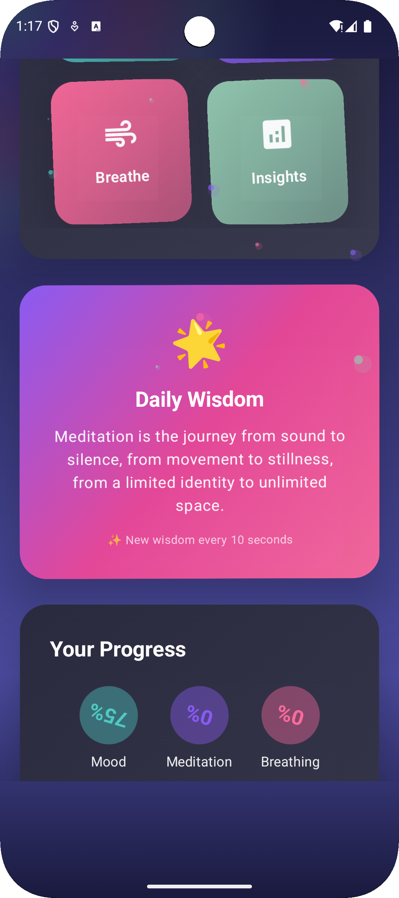
  
  <h3>📈 Progress Tracking</h3>
  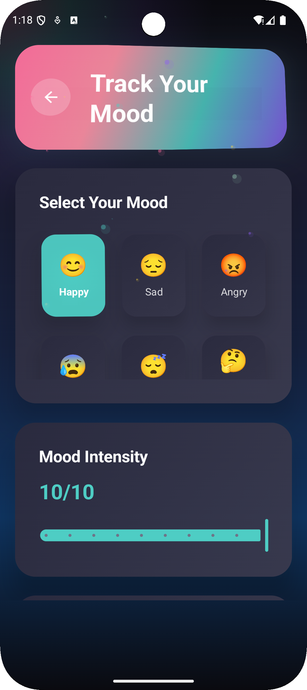
  
  <h3>🎯 Quick Actions</h3>
  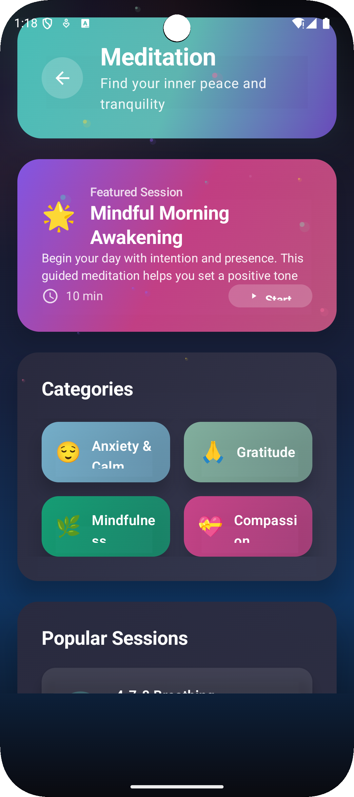
  
  <h3>🌅 Onboarding Flow</h3>
  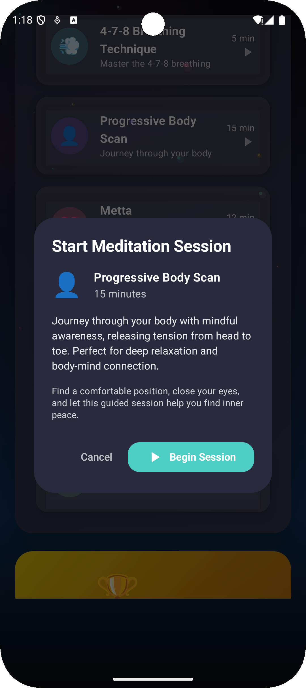
  
  <h3>💡 Daily Wisdom</h3>
  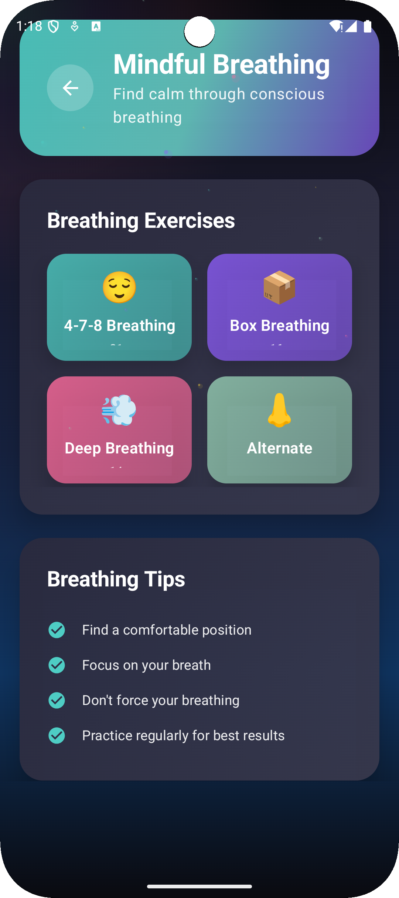
  
  <h3>📊 Analytics Dashboard</h3>
  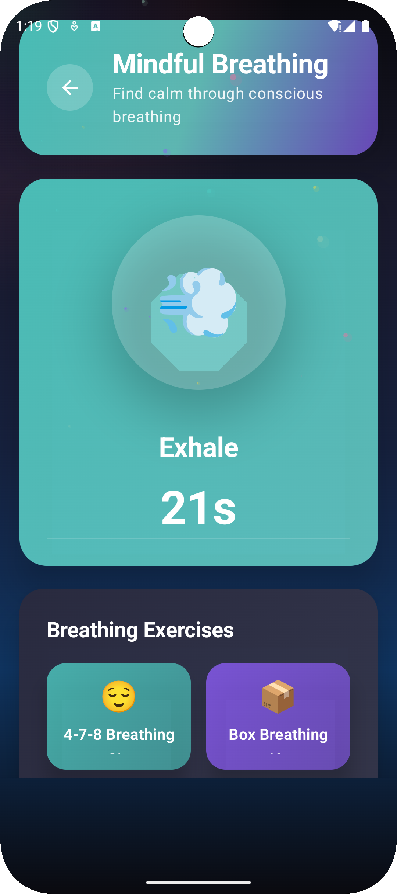
  
  <h3>🎨 Beautiful Animations</h3>
  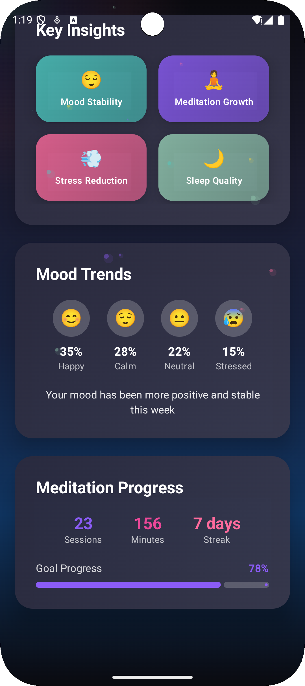
</div>

## 🚀 Getting Started

### Prerequisites
- Android Studio Arctic Fox or later
- Android SDK 24 or higher
- Kotlin 1.8.0 or later

### Installation

1. **Clone the repository**
   ```bash
   git clone https://github.com/yourusername/MindfulMoments.git
   cd MindfulMoments
   ```

2. **Open in Android Studio**
   - Launch Android Studio
   - Select "Open an existing project"
   - Navigate to the cloned directory

3. **Build and Run**
   ```bash
   ./gradlew assembleDebug
   ```

4. **Install on Device**
   - Connect your Android device or start an emulator
   - Click "Run" in Android Studio or use:
   ```bash
   ./gradlew installDebug
   ```

## 🏗️ Architecture

### **Tech Stack**
- **Language**: Kotlin
- **UI Framework**: Jetpack Compose
- **Architecture**: MVVM (Model-View-ViewModel)
- **Database**: Room (SQLite)
- **Dependency Injection**: Hilt
- **Navigation**: Navigation Compose
- **State Management**: StateFlow, MutableStateFlow
- **Animations**: Compose Animations API

### **Project Structure**
```
app/
├── src/main/java/com/example/mindfulmoments/
│   ├── data/                    # Data layer
│   │   ├── local/              # Local database (Room)
│   │   └── repository/         # Data repositories
│   ├── domain/                 # Domain layer
│   │   └── model/              # Data models
│   ├── presentation/           # Presentation layer
│   │   ├── screens/            # UI screens
│   │   ├── components/         # Reusable UI components
│   │   └── theme/              # App theming
│   ├── ml/                     # Machine Learning
│   │   └── MindfulMLManager.kt # ML recommendations
│   └── navigation/             # Navigation setup
```

## 🎨 Design System

### **Color Palette**
- **Primary**: `#4ECDC4` (Teal)
- **Secondary**: `#8B5CF6` (Purple)
- **Accent**: `#FF6B9D` (Pink)
- **Background**: `#1A1A3E` (Dark Blue)
- **Surface**: `#2A2A3E` (Lighter Dark Blue)

### **Typography**
- **Headings**: Inter Bold
- **Body**: Inter Regular
- **Captions**: Inter Light

### **Components**
- **Cards**: Glassmorphic with blur effects
- **Buttons**: Rounded with gradient backgrounds
- **Progress**: Animated circular and linear indicators
- **Charts**: Custom-drawn with smooth animations

## 📊 Features in Detail

### **Mood Tracking**
- **Visual Selection**: Choose from 8 different mood emojis
- **Intensity Levels**: Rate your mood from 1-10
- **Notes**: Add personal reflections
- **History**: View your mood patterns over time
- **Analytics**: Track trends and insights

### **Meditation Library**
- **24+ Sessions**: Authentic guided meditations
- **8 Categories**: Morning, Sleep, Stress Relief, Focus, Anxiety, Gratitude, Mindfulness, Compassion
- **Duration Variety**: 5-20 minutes per session
- **Progress Tracking**: Monitor your meditation journey
- **Favorites**: Save your preferred sessions

### **Breathing Exercises**
- **4-7-8 Technique**: Proven stress relief method
- **Box Breathing**: Military-grade relaxation technique
- **Triangle Breathing**: Simple, effective pattern
- **Custom Patterns**: Create your own breathing exercises
- **Visual Guides**: Animated breathing circles

### **Insights & Analytics**
- **Mood Trends**: Weekly and monthly mood analysis
- **Meditation Stats**: Track your practice consistency
- **Breathing Progress**: Monitor your breathing exercise frequency
- **Wellness Score**: Overall health and mindfulness rating
- **Recommendations**: AI-powered suggestions for improvement

## 🔧 Configuration

### **Database Setup**
The app uses Room database for local storage. No additional setup required - the database is automatically created on first launch.

### **ML Integration**
The app includes a simulated ML system for generating personalized recommendations. In a production environment, this would integrate with TensorFlow Lite or similar ML frameworks.

### **Permissions**
- **Storage**: For saving user data locally

## 🤝 Contributing

We welcome contributions! Please follow these steps:

1. Fork the repository
2. Create a feature branch (`git checkout -b feature/AmazingFeature`)
3. Commit your changes (`git commit -m 'Add some AmazingFeature'`)
4. Push to the branch (`git push origin feature/AmazingFeature`)
5. Open a Pull Request

### **Development Guidelines**
- Follow Kotlin coding conventions
- Write unit tests for new features
- Update documentation for API changes
- Ensure UI follows Material Design principles

## 🌟 Show Your Support

If you find this project helpful, please give it a ⭐️ on GitHub!

---

<div align="center">
  <p>Made with ❤️ and 🧘‍♀️ for the mindfulness community</p>
</div>
